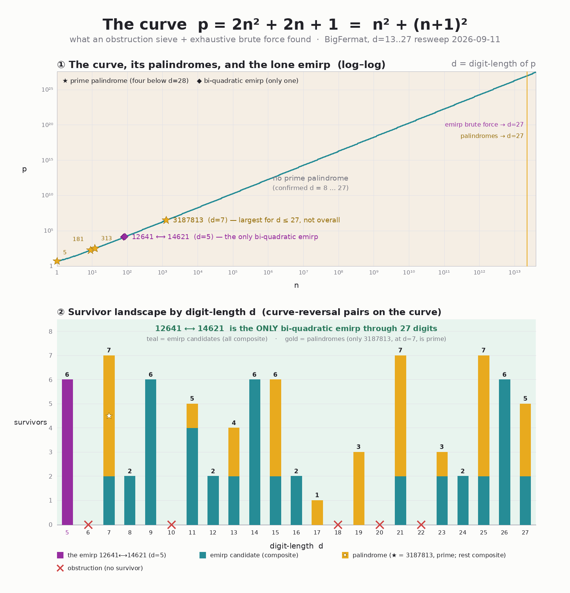

# bi-quad — Bi-Quadratic Emirps & Prime Palindromes on `2n²+2n+1`

A long-running search (part of the **BigFermat** project) on the curve

> **p(n) = 2n² + 2n + 1 = n² + (n+1)²**  — the sum of two *consecutive* squares —

for two kinds of rare prime: **bi-quadratic emirps** and **prime palindromes**.
Every value on the curve is a sum of two **consecutive** squares, `n² + (n+1)²` —
the tightest special case of the sum-of-two-squares primes in Fermat's two-square
theorem (the primes ≡ 1 mod 4). Hence the name.

That consecutive-squares structure pins every value to one of just six two-digit
endings — `{01, 13, 21, 41, 61, 81}` (and, reversed, six leading patterns
`{10, 12, 14, 16, 18, 31}`). It's the cheap first/last-digit **filter that discards
≈ 89% of `p`/`q` candidates instantly (~9× speedup) — roughly 629 billion of the
~707 billion candidates through 24 digits — before any primality test** — a
[proof by construction](docs/ending_constraint_proof.md).



---

## The objects of the hunt

- **Bi-quadratic emirp** — a prime `p = 2n²+2n+1` whose digit-reversal
  `q = rev(p)` is **also** prime **and also** of the form `2m²+2m+1`, with `q ≠ p`.
  (Both ends prime, both on the curve, not a palindrome.) **Exactly one is known:
  `12641 ⟷ 14621` (d=5) — the only one through 24 digits.**
- **Prime palindrome on the curve** — a prime `p = 2n²+2n+1` that reads the same
  forwards and backwards. Four are known: **5, 181, 313, 3187813**.

These two searches turn out to be **the same sieve**: a palindrome is just the
`m = n` case of the emirp relation, so any obstruction kills both.

---

## Results

### `12641 ⟷ 14621` is the only bi-quadratic emirp through 24 digits

There is exactly **one** bi-quadratic emirp in this range — `12641 ⟷ 14621`
(d=5; `79²+80² ⟷ 85²+86²`, both prime). Established by exhaustive `hunt.c` brute
force (every n, GMP-exact, d=5–24), cross-checked against the modular sieve:

```
d = 5                          : EMIRP — 12641 ⟷ 14621  (both prime, both on curve)   ← the only one
d = 6, 10, 18, 20, 22          : OBSTRUCTION — no curve-reversal survivor at all
d = 17, 19                     : only palindromic survivors → no emirp candidate
d = 7,8,9,11–16,21,23,24       : emirp candidates exist, all composite → no emirp
```

(An "emirp candidate" is a *non-palindrome* `n` with both `p` and `rev(p)` on the
curve; palindromes — including the prime `3187813` — are a separate object, shown
in gold in the figure.) Apart from `12641 ⟷ 14621`, every emirp candidate through
24 digits has `p` and/or `q` composite. So `12641 ⟷ 14621` is the smallest — and,
so far, the **only** — bi-quadratic emirp. The next one, if any, has **≥ 25 digits**.

### Prime palindromes: a 27-year conjecture

The **only** prime palindromes on the curve through **25 digits** — confirmed
exhaustively — are **5, 181, 313, 3187813**, all at ≤ 7 digits. (d ≤ 21 via the
modular sieve; **d = 8…25 independently re-confirmed by a direct GMP-certified hunt**
— `palhunt_gmp`, every n, all `found = 0`.) The standing conjecture (Jim, since ~1997):

> **3187813 is the largest prime palindrome on the curve.**

### Structural limits (what *can't* work)

Two roads were rigorously **ruled out** by measurement (see
[`docs/structural_attacks_2026-06-04.md`](docs/structural_attacks_2026-06-04.md)):

- **No faster search.** A meet-in-the-middle attack gives no √-speedup — the
  digit-reversal of a quadratic entangles the middle digits irreducibly. Search
  is **~10^(d/2)-bound** (brute force reaches ~d=25).
- **No congruence proof.** A sweep of 50 base-aligned / 2-power / 5-power moduli
  found **zero** obstructions: the real obstructions are *non-congruential*
  (sporadic). A non-existence theorem, if any, needs new mathematics.

### Heuristic

A coin-flip density argument predicts **bi-quadratic emirps are finite** (expected
≈ `C/d²` per length, sum converges → **total ≈ 1** across all integers), while
**prime palindromes may be infinite** (≈ `C′/d`, sum diverges). The single extra
primality condition for emirps is what tips the balance — and an expected total of
≈ 1 is consistent with `12641 ⟷ 14621` being the only one that exists.

---

## Tools

All C99 + OpenMP; the GMP ones use arbitrary precision for large `p`.

| file | what it does |
|---|---|
| `mod_obstruct.c` | **Modular obstruction sieve** — proves whole digit-lengths impossible via first-k/last-k digit feasibility mod 10^k (exact for d ≤ 2k). |
| `hunt.c` | **Exhaustive emirp brute force** (GMP) — enumerates every `n`, tests `rev(p)` on-curve + both prime. The trustworthy tool for d ≥ 21. |
| `palhunt.c` | **Prime-palindrome hunter** (64-bit, ≤ 19 digits). |
| `palhunt_gmp.c` | Prime-palindrome hunter **past the 64-bit wall** (uint64 `n`, `__int128` `p`, GMP-certified; reaches ~d=27). |
| `generate_graph.py` | Renders the findings figure (pure Pillow — no matplotlib). |

Archived in git history (commit `7f33475`): `mitm_probe.c`, `mitm_probeB.c`,
`congru_probe.c` — the probes behind the ruled-out structural attacks.

---

## Build & run

Requires `gcc`, `libgmp`, OpenMP. The Makefile targets AMD Zen2 (`-march=znver2`);
use `-march=native` elsewhere.

```sh
make                      # or build individually:
gcc hunt.c        -o hunt        -O3 -march=native -std=c99 -Wall -fopenmp -lgmp
gcc palhunt_gmp.c -o palhunt_gmp -O3 -march=native -std=c99 -Wall -fopenmp -lgmp
gcc mod_obstruct.c -o mod_obstruct -O3 -march=native -std=c99 -Wall -fopenmp -lgmp

# emirp brute force, digit-lengths 13..17
./hunt 13 17

# modular sieve: max_d max_k min_k min_d   (e.g. k=10, d=17..21)
./mod_obstruct 21 10 10 17

# prime palindromes on the curve, digit-lengths 21..27
./palhunt_gmp 21 27

# regenerate the figure
python3 generate_graph.py
```

`mod_obstruct` checkpoints to `mod_obstruct.ckpt` and resumes with
`./mod_obstruct <max_d> <max_k>`.

---

## Documentation

- [`docs/PROJECT_OVERVIEW.md`](docs/PROJECT_OVERVIEW.md) — **start here**: goal,
  glossary, the algorithms (pseudocode), bug-history, and the live landscape.
- [`docs/structural_attacks_2026-06-04.md`](docs/structural_attacks_2026-06-04.md)
  — the MITM + congruence foray and why neither cracks it.
- `docs/session_2026-06-04_*.md` — session records (the ≤22 proof, the cliff fix,
  the palindrome unification).
- `docs/modular_obstruction_design.md` — the sieve's original design notes.

---

## Why "BigFermat"

The hunt began after Simon Singh's *Fermat's Enigma* (1997) — a book about
Fermat's *Last* Theorem that sent the search into Fermat's *other* famous result,
the **two-square theorem**: an *odd* prime is a sum of two squares **if and only
if** it's ≡ 1 (mod 4). The curve `2n²+2n+1 = n² + (n+1)²` is the tightest case — a
sum of two *consecutive* squares. Its two rare prizes are **prime palindromes**
(read the same both ways — largest known: `3187813`) and **bi-quadratic emirps**
(reverse to a *different* curve-prime — only known: `12641 ⟷ 14621`). The first
champion — the palindrome `3187813` — was found on a 386 by bending the x87 FPU's
80-bit registers into a 64-bit integer engine. The project has been chasing that
curve ever since.
